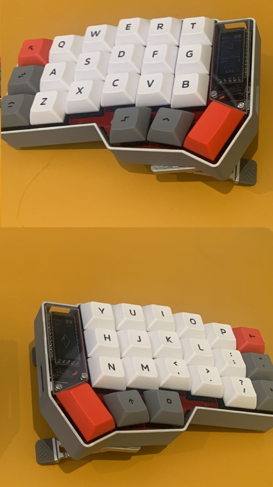

# Alphred Firmware

Firmware for the **Alphred**, a custom-built Corne (CRKBD) 6-column, 42-key split keyboard. This is the second iteration of the original *Alph* firmware, which powered the first version of the build. Alphred V2 aims to improve upon the original in terms of:

- 🧠 **Functionality**
- 🔧 **Maintainability**
- 🎯 **User experience**

The firmware is built using [ZMK](https://zmk.dev/), a modern firmware platform for wireless mechanical keyboards. For further details on syntax and configuration behavior, refer to the [ZMK documentation](https://zmk.dev/docs).

> **Why "Alphred"?**  
> This V2 build features red-colored PCBs, giving rise to the portmanteau *Alph + red* → *Alphred*. Could’ve been *Ralph* for "Red Alph", honestly. Either is good tbh.

---

## 🗂️ Repository Structure

### `config/corne.keymap`
Defines the keyboard layout, key bindings, behaviors (e.g. hold-tap, layers, macros), and other input logic for the Corne build.

### `config/corne.conf`
ZMK configuration file that controls lower-level keyboard behavior such as debounce timing, power management, and feature toggles.

### `build.yaml`
Specifies build targets for multiple board and hardware configurations. Examples include:

- **MCUs:** `nice_nano_v2`, `rp2040_pro_micro`
- **Displays:** `nice_oled`, `nice_epaper`

Customize these to generate specific firmware builds for each half or hardware variant.

### `west.yaml`
Controls dependency and module management via [west](https://docs.zephyrproject.org/latest/develop/west/index.html). It pulls in the main ZMK repo, along with any plugins or shield adapters required for the Alphred firmware.

### `.github/workflows/build.yml`
GitHub Actions workflow that automatically compiles build artifacts on push or PR. Outputs firmware binaries for each configured target in `build.yaml`.

---

## 🧪 Building Locally

To build the firmware locally (make sure you have the relevant compilers first):

```bash
west build -s zmk/app -d build/left -b nice_nano_v2 -- -DSHIELD=corne_left -DZMK_CONFIG=config
```
Adjust SHIELD and BOARD as needed for your hardware and layout.

